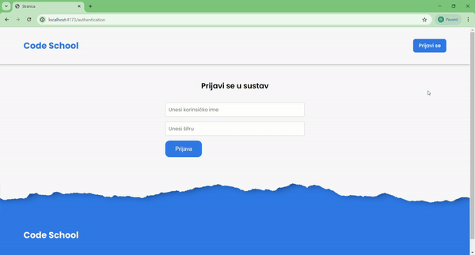

# React Code School



[Video of how it works](https://drive.google.com/file/d/1ba-sul8B827Eb9hsugbDy0qFw0UfDmDZ/view?usp=sharing)

Welcome to the Code School, a project built with React.js and TypeScript intergrated with [Django REST API](https://github.com/Roko03/django-code-school). This role-based project features a secure login page where users must authenticate with their credentials. Depending on their role users are redirected to specific pages with tailored functionalities:
- **Admin Role:** Access to create, edit, and delete users, organizations, and workshops
- **Professor Role:** Access to view students enrolled in workshops
- **Student Role:** Access to see workshops and enrollment status

## Summary

For this project, I utilized a React template that I created, incorporating a well-organized SCSS structure where each component has its folder.

TypeScript Integration

I created TypeScript types for the data based on [Django Models](https://github.com/Roko03/django-code-school/blob/main/backend/api/models.py).

Design and Styling

I defined typography for the project using two Google Fonts: Poppins and Roboto. 

**Authentication**

For this project, I developed (`useAuthContext.tsx`) that streamline authorization functionalities. This context enables easy invocation of essential functions like login and logout. I implemented a token expiration check function that automatically renews expired tokens. Every render includes a check to verify user authorization status. Authorized users can seamlessly fetch their data, while unauthorized users are redirected to the authentication page. 

**Routes**

In [React Route](https://reactrouter.com/en/main) you can make layout for checking users routes. I make:
- (`AuthenticationRoute.tsx
`) - check user authentication
- (`ProtectedRoute.tsx`) - check user role

**CRUD Operations**

- GET - method for get data from Django REST API
- POST - method for create data on Django REST API
- PATCH - method for edit data on Django REST API
- DELETE - method for delete data from Django REST API

**Challenges and Solutions**

The most challenging part of project was developing and implementing role-based routes. I am particularly proud of my work on the authentication manager (`useAuthContext.tsx`). This component efficiently manages authentication, user data retrieval, and token expiration updates.

## Project Structure
- **Folders and Files:** The project follows modular structure for folder with components, pages and utilities
- **Technologies Used:** React.js, SCSS, TypeScript, React Router
- **CRUD operations:** Four basic operations(Create, Read, Update, Delete)
- **React Hook Form:** Remove unnecessary re-renders and validate forms 
- **Zod:** TypeScript validation schema
- **Considerations:** Main focus is integrating [Django REST API](https://github.com/Roko03/django-code-school) that I developed. I've implemented secure authentication and protected routes to ensure that users are appropriately redirected based on their roles.  

## Time Spent

I need 50-70 hours of work to make this project.
## How to Use

Make sure you have the following installed on your computer:

- [git](https://git-scm.com/)
- [node.js](https://nodejs.org/en)
- [npm](https://www.npmjs.com/)
- [react-hook-form](https://react-hook-form.com/)
- [zod](https://zod.dev/)
- [react-router](https://reactrouter.com/en/main)
- [jwt-decode](https://www.npmjs.com/package/jwt-decode)

Clone the repository

```bash
git clone https://github.com/Roko03/code-school.git
cd code-school
```

Installation

```bash
npm i
#or
npm install
```

Running the Project

```bash
npm run dev
```

Open [http://localhost:3000](http://localhost:3000) to view the project
